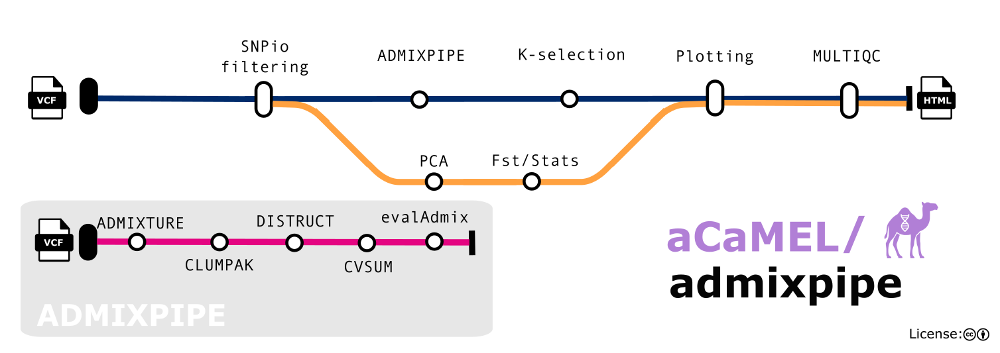

# Summary

Delineating population structure is fundamental to evolutionary inference and conservation decision-making, where genetically differentiated groups may inform the designation of conservation and management units [@Funk2012; @Hohenlohe2021]. Model-based clustering has become a *de facto* standard for this purpose, initially popularized by STRUCTURE [@Pritchard2000; @Novembre2016] and subsequently extended to genome-scale datasets by programs such as ADMIXTURE [@Alexander2009]. These methods posit *K* ancestral populations with distinct allele frequencies and estimate each individual’s ancestry as a mixture of contributions from them. Defensible inference, however, requires more than fitting a single model: data must be filtered, models fitted repeatedly across values of *K*, replicate solutions reconciled, an optimal *K* selected, and model adequacy evaluated.

aCaMEL/admixpipe automates this analytical sequence. Beginning with a VCF and population map, it filters loci and individuals, conducts replicated ADMIXTURE analyses, reconciles replicates into distinct clustering modes, applies alternative criteria for selecting *K*, evaluates model fit, and optionally projects ancestry estimates onto geographic maps. Results and analytical provenance are consolidated within a single interactive report. By automating this foundational population-genetic analysis, the pipeline makes it accessible, standardized, transparent, and defensible, thereby broadening its adoption and application.

# Statement of need

Population-structure inference is sensitive to decisions made both before and after model fitting. Minor-allele-frequency thresholds [@Linck2019] and missing-data filters [@HuangKnowles2016] can alter the structure recovered; uneven sampling [@Puechmaille2016; @Wang2017] and hierarchical population structure [@Kalinowski2011; @Janes2017] can bias commonly used criteria for selecting *K*; and ancestry barplots invite overinterpretation when presented without formal evaluation of model adequacy [@Lawson2018]. Because these decisions are seldom reported comprehensively, ostensibly equivalent analyses may not be reproducible. A reanalysis of published STRUCTURE studies, for example, failed to recover the reported number of clusters in 30% of cases [@Gilbert2012].

These limitations are consequential for applied conservation genetics, where analytical results increasingly inform management-unit delineation, listing decisions, and stocking policies. Nevertheless, a persistent divide remains between conservation-genetic research and its implementation [@Taylor2017; @Kadykalo2020; @Klutsch2021]. A systematic review identified definable management outcomes in only 49 of 115 applied studies [@Tkach2023]. Standardized workflows have therefore been proposed as one mechanism for strengthening the connection between conservation science and practice [@Holderegger2019].

aCaMEL/admixpipe addresses these methodological and translational needs for population geneticists, molecular ecologists, agency geneticists, and their contractors. It combines a validated analytical core with scalable execution, explicit parameterization, standardized diagnostics, and provenance-rich reporting.

# State of the field

The original AdmixPipe [@Mussmann2020] addressed the absence of standardized pipelines for replicated ADMIXTURE analyses, despite the availability of comparable workflows for STRUCTURE. It accepts a VCF and population map, filters and converts the genotype data, executes ADMIXTURE repeatedly across candidate values of *K*, summarizes cross-validation error, and prepares replicate outputs for analysis with CLUMPAK [@Kopelman2015]. AdmixPipe v3 [@Mussmann2023] retains this functionality while accepting PLINK input, incorporating CLUMPAK directly, distinguishing major and minor clustering modes, summarizing likelihood and cross-validation statistics within modes, and applying evalAdmix [@GarciaErill2020] to each replicate. Distribution within a Docker container standardizes its otherwise complex software environment. Both generations nevertheless execute largely as monolithic, single-host analyses, leaving scheduling, fault recovery, and portability among computing environments to the user.

Related software addresses individual components of this process. fastSTRUCTURE [@Raj2014] provides variational inference for large SNP datasets, while principal component analysis offers a model-free representation of genomic variation [@Patterson2006]. STRUCTURE HARVESTER [@Earl2012] implements the Evanno method [@Evanno2005]; CLUMPP [@Jakobsson2007] and CLUMPAK reconcile label switching and multimodality among replicates; pong [@Behr2016] and pophelper [@Francis2017] support visualization; and StructureSelector [@Li2018] integrates alternative estimators of *K*. This functionality remains distributed among programs with distinct inputs and execution requirements, and assembling them into a complete analysis poses hurdles that limit adoption of the best practices they promote.

scalepopgen [@Upadhyay2024] provides a broader Nextflow framework for population-genomic analysis and includes ADMIXTURE, cross-validation summaries, and ancestry visualization. However, it performs one analysis per value of *K* and does not reconcile replicate solutions, distinguish alternative clustering modes, or evaluate their fit. aCaMEL/admixpipe instead preserves the replicated, mode-aware analysis developed through AdmixPipe and AdmixPipe v3 while re-engineering its execution as a modular Nextflow workflow. It adds SNPio-based preprocessing [@Martin2026], alternative criteria for selecting *K*, spatial summaries, and integrated reporting without reimplementing the established ADMIXTURE, CLUMPAK, distruct [@Rosenberg2004], or evalAdmix functionality.

# Software design

## Workflow framework

The pipeline is implemented in Nextflow DSL2 [@DiTommaso2017] using the nf-core template [@Ewels2020] (\autoref{fig:workflow}). Its computational burden scales with the product of the numbers of candidate *K* values and analytical replicates, most of which are independent, long-running tasks. Workflow orchestration therefore enables parallel execution, checkpointed resumption, and consistent behavior across workstations, high-performance computing systems, and cloud environments [@Wratten2021]. Nextflow currently supports 18 schedulers or cloud services and seven container engines [@Langer2025].

nf-core provides schema-validated parameters, automated linting, continuous integration with bundled test data, and a library of reusable modules through which research communities can “adopt common standards progressively” [@Langer2025]. These conventions operationalize FAIR principles for research software [@Wilkinson2016; @Barker2022].

## Design decisions

- **Containers for portability** Every process executes within a container [@Gruning2018]; the pipeline supports Docker, Singularity/Apptainer, and Podman. This design exchanges package-manager flexibility for a consistent, versioned runtime environment.

- **Filtering and QC** Variant filtering is integrated via SNPio [@Martin2026] and applied in a fixed order, removing loci with excess missing data in any population, monomorphic loci, loci within a set physical distance of one another, loci and then individuals with excess missing data, and loci below a minor-allele-frequency threshold [@Linck2019]. Missingness is quantified per individual and population before and after filtering, and locus attrition is attributed to each filter. Pairwise Weir and Cockerham’s *F*~ST~ [@WeirCockerham1984], with permutation *p*-values, and a principal component analysis provide model-free comparisons.

- **Selection and validation of *K*** Five criteria are implemented: cross-validation error [@Alexander2011], Evanno Δ*K* [@Evanno2005], and the elbow of the mean log-likelihood [*L*(*K*)] or of its first- [*L*′(*K*)] or second-order [|*L*″(*K*)|] rate of change. The selected criterion determines only which value of *K* is emphasized. Ancestry barplots, evalAdmix residual correlations, and maps are generated for every candidate value because no criterion performs reliably across all demographic scenarios [@Janes2017; @Puechmaille2016].

- **Standardization and interpretability** Filters are applied in a fixed order under documented defaults, and all outputs are consolidated within a self-contained MultiQC report [@Ewels2016]. The report presents results as fully interactive, publication-ready figures including embedded metadata and can optionally include maps of site-level ancestry over user-supplied vector layers (or a default basemap). An [example report](https://raw.githack.com/UARK-aCaMEL/admixpipe/master/assets/example_report.html) for the bundled test dataset is available online (\autoref{fig:report}). It records the command-line, pipeline and tool versions, configuration profiles, and complete parameter set, while also generating a methods summary with citations for the software used. These features automate the reporting practices recommended by @Gilbert2012, facilitating comparisons among studies and enabling analyses to be audited.

# Research impact statement

aCaMEL/admixpipe extends AdmixPipe, which has been in use by multiple research groups already. The Nextflow implementation has already supported agency-funded conservation assessments: it was used to characterize spatial population structure in the endemic Beaded Darter (*Etheostoma clinton*)[@Bruckerhoff2026], investigating admixture in a genomic assessment of Smallmouth Bass (*Micropterus dolomieu*)[@Douglas2026], and to validate SNP panel selection in Eastern Collared Lizard (*Crotaphytus collaris*)[@Douglas2026lizard]. The release includes a bundled test dataset with sampling coordinates and geospatial data for Neosho Madtom (*Noturus placidus*)[@Zbinden2025].

# AI usage disclosure

Generative AI tools assisted with preparation of the software release and manuscript. Their uses included drafting documentation and the parameter schema, implementing the report’s parameter summary, identifying and correcting workflow defects, verifying references, and assisting with manuscript drafting and revision. The authors reviewed, edited, and tested all AI-assisted contributions, made all scientific and software-design decisions, and accept full responsibility for the software and manuscript.

# Acknowledgements

We thank the nf-core community for providing the pipeline template. Applications of the pipeline were supported by the U.S. Fish and Wildlife Service State Wildlife Grants Program through the Arkansas Game and Fish Commission (AR-T-F22AF03392). M.R.D. and M.E.D. acknowledge support from the Bruker Professorship in Life Sciences and the 21st Century Chair in Global Change Biology, respectively, at the University of Arkansas. The funders had no role in the design of the software or preparation of the manuscript.

Links to non-Service websites do not imply official U.S. Fish and Wildlife Service endorsement of the opinions or ideas expressed therein or guarantee the validity of the information provided. The findings, conclusions, and opinions expressed in this article are those of the authors and do not necessarily represent the views of the U.S. Fish and Wildlife Service.

# References
